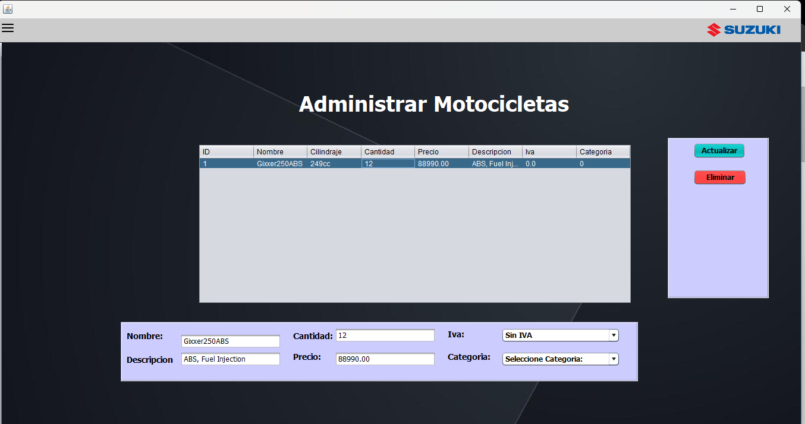
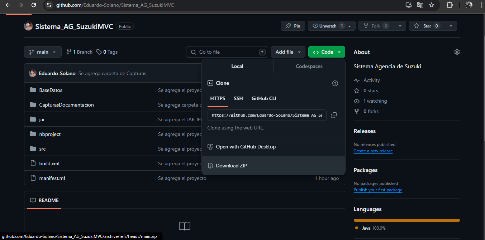
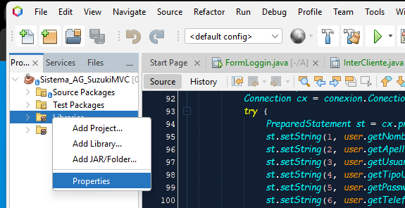
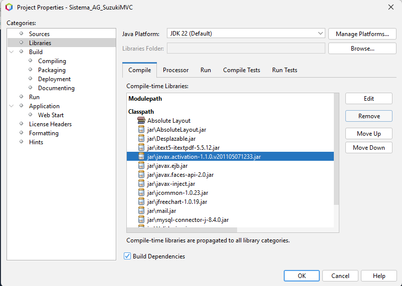
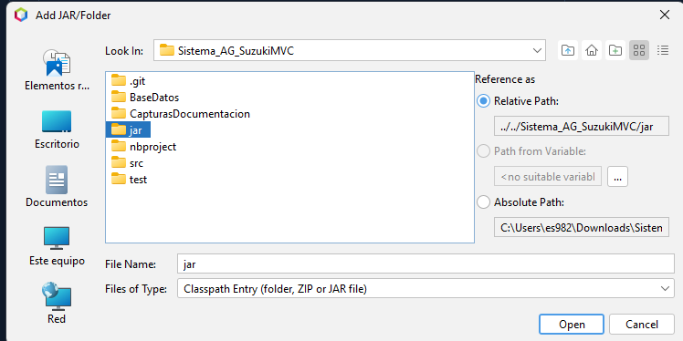
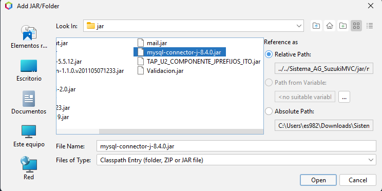
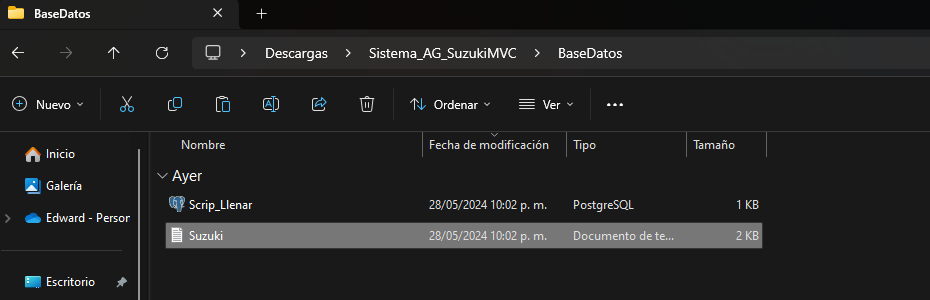
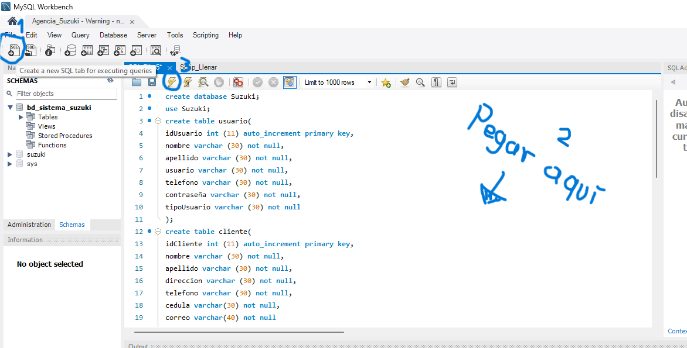
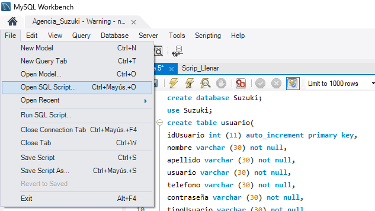
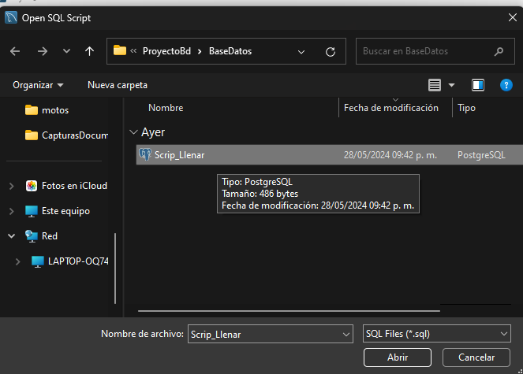

# Sistema Agencia_Suzuki MVC

## Descripcion
En el siguiente proyecto, realizamos un sistema de ventas para una agencia de motos, basandonos en la marca Suzuki. Cabe recalcar que este proyecto fue elaborado con fines educativos. Nuestro sistema esta estructurado empleando MVC (modelo, vista, controlador), para hacerlo mas visible las clases y los frames estan en packages distintos `Controlador` , `Vista`, `Modelo`, ademas de emplear otros packages.

## Caracteristicas
- Las caracteristicas principales del Sistema es gestionar las ventas realizadas en una agencia de motocicleta.
- De igual forma sirve para llevar un registro detallado de la agencia en la que se implemente.

## Requisitos
- Java JDK 21 o superior

## MVC
Para que nuestro sistema funcione correctamente es importante mencionar los 4 paquetes mas importantes conexion, controlador, modelo y vista. estos paquetes son la base fundamental del sistema, a continuacion explicare lo mas claro posible como funciona y como se relacionan estos paquetes.
### Conexion
En este paquete se encuentra la clase que nos permitira conectarnos a nuestra base de datos (suzuki), este metodo lo mandaremos a llamar cada vez que ocupemos hacer una consulta.
Cabe mencionar que los datos de usuario y contraseña van a variar segun SQL workbench. Es decir esos tendras que modificarlos con el usuario y contraseña con los que ingresas a la base de datos.
El Script de la base de datos se encuentra en una carpeta llamada Base e Datos, dentro del proyecto.
### Modelo
En este paquete se encuentran todas las clases que nos permitiran crear objetos e instanciarlos, estos objetos van a servir como modelos, es decir un modelo para poder insertar, actualizar y eliminar registros de nuestra base de datos, entonces nuestros modelos son los encargados de poder ser añadidos a nuestra base de datos, ya que por medio de estos nos resulta mas facil la manipulacion de estos datos. Entre algunas clases que tenemos dentro de este paquete son: Modelo_Cliente, Modelo_ Usuario, Modelo_Moto, Modelo_Veta, etc.
Cada uno cumple su papel importante dentro de nuestro sistema. Entonces decimos que los modelos son empleados para poder modificar los registros de nuestra base de datos, de igual forma para guardar la informacion proveniente de esta misma.
A continuacion se mostrara un ejemplo de una clase modelo:

#### Modelo_Cliente
La clase `Cliente` es utilizada para construir nuestros objetos de tipo *Cliente*.
#### Variables
| Tipo | Nombre de la variable| Descripción |
|------|-------|-------------|
| `int` | `idCliente` | Se utiliza para guardar el id del Cliente. |
| `String` | `nombre` | Es utilizada para guardar el nombre del Cliente. |
| `String` | `apellido` | Es utilizada para guardar el apellido del Cliente. |
| `String` | `cedula` | Es utilizada para guardar la cedula del Cliente. |
| `String` | `telefono` | Es utilizada para guardar el telefono del Cliente. |
| `String` | `direccion` | Es utilizada para guardar la direccion del Cliente. |
| `String` | `correo` | Es utilizada para guardar el correo del Cliente. |

#### Constructor
| Constructor | Descripción |
|-------------|-------------|
| `Modelo_Cliente()` | El constructor no recibe parametros. |

#### Metodos
Los metodos que se declaran en esta clase son los getter y setter de los atributos antes mencionados, al igual que el toString().

### Vista
El paquete vista son aquellas clases en las cuales se relaciona todo lo visual, lo que permite la interaccion directa con el usuario final, dentro de este paquete se encuentra nuestra interfaz grafica, desde paneles, frames, dialogos, y otros componentes. 
La vista desempeña un papel crucial como interfaz entre la aplicación y el usuario. Es responsable de presentar los datos del modelo de una manera significativa y atractiva para el usuario, y de capturar la interacción del usuario con la aplicación. La vista no está involucrada en la lógica ni en el almacenamiento de datos; estas responsabilidades pertenecen al modelo y al controlador, respectivamente. 
 Para que la vista funcione en nuestro sistema, es importante relacionar muy bien con el Modelo y el Controlador, es decir en nuestra vista tenemos paneles en donde se permite agregar usuarios, motocicletas y clientes, para ello se hace una consulta para verificar que no existan en la base de datos y evitar redundancia, esto se logra por medio del controlador, despues de verificar que todo esta en orden, se hace uso del modelo para recolectar los datos que vayamos a ingresar y posteriormente vaciar ese modelo en nuetra base de datos.
 Algunos ejemplos de clases en nuestro paquete vista son: FormLoggin, es el encargado de darte acceso al sistema:
 
Sistema, es el encargado de poder interactuar con todos los apartados de nuestro sistema.

Esos son algunos ejemplos de vista en nuestro sistema.


### Controlador
El paquete controlador es el encargado que permite la interaccion entre nuestra base de datos, los modelos y sobre todo la vista. El controlador es aquel que tiene la mayoria de la logica empleada en nuestro sistema, dentro de los controladores es donde se realizan las consultas a nuestra base de datos, dentro de estas mismas clases se encuentran los metodos para eliminar, actualizar, e insertar, asi mismo algunos metodos que nos permitiran validar  algunas cosas en el caso de usuario, nos permite validar que no se repitan los usuarios dentro de nuestra base de datos; para clientes que no se repitan los correos y la cedula, y en el caso de la motocicleta el id y el nombre.
Algunas clases que tenemos dentro de este paquete son (Ctlr_Usuario, Ctrl_Cliente, Ctrl_Moto, Ctrl_Correo, VentaPDF).

#### Ctrl_Usuario
La clase `Ctrl_Usuario` es empleado para poder hacer nuestras consultas y modificaciones a la base de datos.

#### Metodos
| Nombre | Dato retornado | Parametro | Descripción |
|--------|--------|-------------------------|-------------|
| `logginUser()` | `boolean` | `Modelo_Usuario` | Este metodo nos permitira iniciar sesion ya que realizara una consuta a la base de datos para verificar los usuarios contenidos. |
| `guardarUsuario()` | `boolean` | `Modelo_Usuario ` | Es aquel que se encarga de guardar el usuario en nuestra base de datos, como podemos observar recibe un parametro de tipo Modelo_Usuario, con el cual nos apoyaremos a la hora de guardar nuestro user. |
| `actualizarUsuario()` | `boolean` | `Modelo_Usuario ` | Es aquel que se encarga de actualizar el usuario en nuestra base de datos, como podemos observar recibe un parametro de tipo Modelo_Usuario, con el cual nos apoyaremos a la hora de guardar nuestro user. |
| `existeUsuario()` | `boolean` | `Modelo_Usuario ` | Es aquel que se encarga de verificar si el usuario ya existe en nuestra base de datos, como podemos observar recibe un parametro de tipo Modelo_Usuario, con el cual nos apoyaremos a la hora de guardar nuestro user. |
| `eliminarUsuario()` | `boolean` | `Modelo_Usuario ` | Es aquel que se encarga de eiminar el usuario en nuestra base de datos, como podemos observar recibe un parametro de tipo Modelo_Usuario, con el cual nos apoyaremos a la hora de guardar nuestro user. |

Como podemos observar en esta clase todos los metodos realizan una consulta a la base de datos y apoyandose de la clase Modelo_Usuario agrega, actualiza, verifica y elimina datos en nuestra base de datos.

Bueno entonces ya sabemos como es que funciona el MVC en nuestro Sistema, al principio parece complejo usar esta estructura y algo dificil, pero resulta mas facil y practico tener un sistema ordenado y separado por MVC, ya que una de sus ventajas es que puedes identificar mas facilmente los errores y bugs que se puedan presentar en nuestro proyecto, entonces si bien es un poco tedioso estar separando todo, es mas recomendable realizarse de esta forma por convencion.

## Instalacion y Compilacion en Netbeans
Para poder instalar y ejecutar el sistema es necesario seguir estos pasos:
1.  Obtener un clone del repositorio con el siguiente comando:
```bash
git clone https://github.com/Eduardo-Solano/Sistema_AG_SuzukiMVC.git
```
De igual forma puedes descargarlo en formato `ZIP`



2. Abre el proyecto en el IDE que gustes.
3. Verifica que compile sin errores.
4. En caso de que te marque algun error relacionado con el JDK, asegurate de estar utilizando un JDK 21 o superior.
5. Si utilizas un JDK inferior a 21, aqui te dejo un video tutorial de como cambiar el JDK de tu proyecto.

   Link del video: https://youtu.be/j7ACYObJNtw?si=bp-nwU7BnsJabt2S

7. Primero debemos remover todos los archivos que pueden causar errores en nuestro proyecto:
- Seleccionamos nuestro proyecto y buscamos la carpeta LIbrerias y damos clic derecho sobre ella y clic en propiedades.



- Ahora seleccionamos todos los que aparezcan en rojo y le damos clic en remover.



6. Dentro de la carpeta del proyecto existe un folder llamado jar, esa carpeta contiene todos los .JAR que se emplearon en este proyecto, es importante añadir todos los JAR que estan en esa carpeta  a nuestro proyecto.
- Damos clic derecho sobre la carpeta Librerias y clic en Add JAR/Folder


- Ahora solo buscamos nuestra carpeta de nuestro proyecto y nos drigimos dentro de la carpeta jar, ahi es donde se encuentran todos nuestro JAR.



- Solo toca añadir cada JAR uno por uno para evitar errores de compilacion, entonces nuestros errores de compilacion desapareceran.



7. En ocasiones Netbeans te arrojara un mensaje el cual dice que para compilar el proyecto debes actualizar tu JDK, en ese caso actualizalo.

## Creacion de base de datos
Para nuestra base de datos es importante tener el manejador SQL WorkBench instalado, esto es para hacer mas facil la creacion de la base de datos. 
Link de tutorial de instalacion: 
https://youtu.be/_K2nOYwOq1E?si=WrE-2L4bpBcDbsCY

Sigue los pasos que se expecifican a continuacion:
1. Ejecuta el Script que viene dentro de la carpeta BaseDatos, dentro de nuestro proyecto, este Script se llama suzuki, en caso de que venga en txt, solo copia el contenido y pegalo en SQL Workbench.



Dentro de SQL Workbench, pegar el contenido del Script.



4. Nos tiene que compilar sin errores, ahora solo queda ejecutar el otro Script, para añadir un usuario y asi poder acceder al Sistema.
-Damos clic en File y Sql Script.



-Y solo seleccionamos el otro Script de la misma carpeta BaseDatos.


Ahora solo queda ejecutar dando clic en el Rayito que aparece en nuestra barra de herramientas.

## Funcionamiento
En el siguiente link encontraras el funcionamiento del sistema:

Da clic para ver: 
